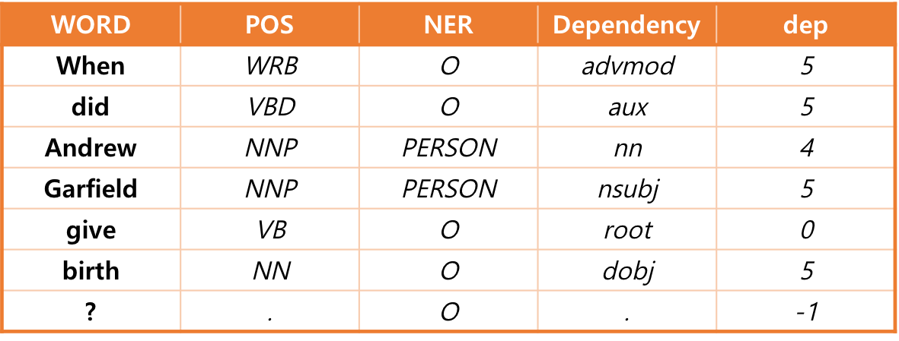

Question-Answering-System
===============
##### Knowledge based QA system using FreeBase, StanfordNLP with 정원태

Knowledge based QA system이란 사용자의 질의를 이해하고, 지식베이스 내의 정보를 이용하여 응답을 제시하는 시스템이다.

본 프로젝트에서는 다양한 질의어의 형태(언어처리)를 정규화된 형태로 변환(질문 정규화 모듈 구현)하고 사용자의 질의에 적합한 답을 제시하는 시스템을 구현한다.

#### Implementation
- Language: C++
- Tool: Visual Studio 2012
- Database: FreeBase ( 5 entities, 15 properties each )
- Library: Stanford CoreNLP, Freebase API, CURL, JSON
 
> *현재 Freebase는 구글에 인수된 상태로 운영을 중단하였다. 따라서, 본 시스템을 구현했을 때와 현재(2018.03) Freebase에서 데이터를 제공하는 방식이 다르지만, 여전히 개발자들을 위해 DB dump와 API를 제공해주고 있다.*
 
### Process
   [1. Select Entities and Properties from Freebase](#1-select-entities-and-properties-from-freebase)
 
   [2. Implement Natural Language Processing Module](#2-implement-natural-language-processing-module)
 
   [3. Implement Question Normalization Module](#3-implement-question-normalization-module)
 
   [4. Load Question Answer](#4-load-question-answer)
 
   [5. Result](#5-result)

****
## Overview
<p align="center">
   </img>
</p>

## 1. Select Entities and Properties from Freebase

먼저 우리가 질문에 답할 주제(entity-정보의 세계에서 의미있는 하나의 정보 단위)를 선정한다. 여러 타입(인물, 기업, 영화 등)에서 5개의 Entity를 선정하여 FreeBase에서 각 entity의 속성 및 값을 찾는다. 

우리는 영화배우 앤드류 가필드, 국가 라오스, 영화 "Magic in the Moonlight", 연세대학교 그리고 스포츠팀 뉴욕 양키즈를 선택하였고, 각 주제마다 정답을 찾을 15개 이상의 속성값을 찾았다. 

또한, 이후 자연어처리 모듈 구현 과정에서 사용할 [질문set](/questions.txt)을 만들었다.

> 예를 들어, 앤드류 가필드의 여자친구가 누구인지를 알고싶다면 다음과 같이 여러 형태로 물어볼 수 있다. 이 모든 경우에도 답할 수 있도록 미리 질문set을 만들어놓아 대응할 수 있도록 구현하였다.
>	```
> Who is Andrew Garfield's partner?
> Who have been going out with Andrew Garfield?
> Who have been dating Andrew Garfield?
>	```   

## 2. Implement Natural Language Processing Module

사용자로부터 들어온 자연어 형태의 질문의 의미를 분석하기 위해 단어의 품사를 분석(POS-tagging)하고, 문장내의 개체명을 인식(Named Entity Recognition)하고, 문장 구조를 분석(Parsing)해야 한다.

본 프로젝트에서는 Stanford CoreNLP를 사용하여 진행하였다. Stanford CoreNLP 라이브러리를 사용하면 질문(input)에 대한 결과를 xml 파일(output)로 생성되는데, 라이브러리 libxml2를 사용하여 프로그램 내에서 xml 파일 정보를 로딩한다.
<p align="center">
   </img>
</p>

 ### POS-Tagging
 - 품사(Part-of-speech: 각 단어가 속한 유형)
 - 각 단어의 적합한 품사를 부착한다.
 - 위 표에서 POS부분을 확인하면 된다.
   
 ### NER (Named Entity Recognition)
 - 인명, 지명, 기관명 등과 같은 개체명 인식 및 분류에 적합한 태그를 부착한다. 주로 명사나, 고유 명사를 후보로 한다.
 - 위 표에서 NER부분을 확인하면 된다.
 
 ### Parsing
 - 문장을 이루고 있는 구성 성분으로 분해하고, 그들 사이의 구조적 관계를 분석하여 문장의 구조를 결정한다.
 - 문장 내의 구성 성분 간의 관계를 이용하여 다양한 활용이 가능하다. 

## 3. Implement Question Normalization Module

<p align="center">
   </img>
</p>

이제 자연어 처리 모듈에서 얻어진 언어 분석 정보를 활용하여 Freebase에서 검색할 수 있는 표현으로 변형할 차례이다. 본 프로젝트에서는 이를 질문의 정규화라고 표현한다.

Freebase로 날릴 쿼리의 형태는 위 그림과 같다. 쿼리에서 보이다시피, 우리는 질문 대상(subject)과 질문의 술부(predicate)를 인식해야 쿼리를 완성할 수 있다.
```
아래 예시에서 질문의 대상인 "Andrew Garfield"를 통해 쿼리에서 "name" 부분과 "mid" 부분을 채울 수 있으며, 
술부인 "When, give, birth"로 쿼리의 property 부분을 채울 수 있다.
```
### 질문 내의 대상 인식
질문 내의 대상을 인식할 때의 문제점은 질문의 대상이 다양한 형태로 표기될 수 있다는 점이다. 따라서, entity 표기에 대한 사전을 미리 구축하고 명확한 지정을 위하여 아이디(mid)를 사용한다. 

우리는 문장 내에서 POS가 NNP 이거나 NNPS인 단어를 뽑고, 미리 만들어 놓은 table에서 해당 단어가 포함된 entity와 mid를 뽑아내었다.
위 예시에서 NNP 또는 NNPS인 것은 "Andrew"와 "Garfield"이다. 이 단어들이 매칭된 entity와 mid는 각각 "Andrew Garfield"와 “/m/0fjmbk"이다.

해당 함수는 source.cpp/getname()에서 확인할 수 있다.

### 술부 정규화
들어온 질문이 어떤 것을 묻고 있는지를 파악하는 지가 본 프로젝트의 핵심이다. 
우리는 질문의 핵심이 되는 단어들을 추출해내고, 이 핵심 단어들이 미리 만들어 놓은 keyword 테이블과 가장 많이 겹치는 property를 가져올 것이다.
```
예를 들어, " **When** was Andrew Garfield born?" 이라는 질문이 들어왔을 때, born 단어 정보로는 충분하지 않다. 
만약 born 단어만 활용한다면, " **Where** was Andrew Garfield born?" 라는 질문이 들어왔을 때와 비교가 불가능하기 때문이다. 
따라서, 이 경우에는 "When"과 "born"을 핵심 단어로 추출해야만 property인 "date_of_birth"를 얻을 수 있을 것이다.
```
우리는 시작 의문사를 기준으로 case를 나누고, 각각 세부적인 룰을 적용하여 각 문장의 핵심이 되는 단어를 추출하였다. 기본적으로는 단어 간 의존관계 정보를 활용하여 최대한 모든 경우에 대해 대응할 수 있도록 구현하였다. 또한, key가 중복 추출되었다는 것은 그만큼 여러 rule에 적용되어 중요한 단어일 확률이 크다고 판단하여, 이러한 key에는 추가적으로 weight을 주었다.

우리의 정규화 알고리즘으로 추출한 각 단어의 핵심 단어들은 [extractedKey](/extractedKey.txt)이며, 각각의 구체적인 룰은 함수 source.cpp/normalization(bool) 내에서 확인해 볼 수 있다.

위 자연어처리모듈 구현 파트에서 든 예시 "When did Andrew Garfield give birth?"에 대해서 구체적으로 설명해보자.

시작 의문사가 When일 때의 rule에 따라, 추출되는 단어는 POS가 VBZ와 VBD가 아니고 dependency가 root인 “give”와 root를 참조하는 (즉, dep가 5인) 단어 중, pos가 NN 또는 NNS 또는 JJ인 “birth”이다. “birth”를 참조하는 단어는 없으므로, 더 이상 조건에 만족하는 단어는 없다.

기본적으로 의문사는 핵심 key에 포함되므로, 결과적으로 table과 비교하게 될 문자열들은 **{“what”, “give”, “birth”}** 이다. 이것과 가장 많이 매치된 property는 “/people/person/date_of_birth”이다. - match 단어 수: 3 - ([Keyword 테이블](/Keywords_new.txt) 참고)

무슨 말인지 1도 알아 듣지 못하겠다면, 그게 정상이다. 몇 날 밤낮을 새서 손수 노가다로 룰을 찾아낸 것이기 때문에 이해하지 못할 수준인 것을 안다. 이 시스템을 구현할 때까지만 해도 딥러닝이니 뭐니 그런거 안 가르쳐줬다...ㅠㅠ

## 4. Load Question Answer
<p align="center">
 </img>
</p>
이제 위에서 정규화한 질문을 Freebase API를 통해 정답을 가져오자.
정규화된 질문은 라이브러리 curl을 이용해 Freebase API에 요청을 한다. API에서 리턴된 json형식의 값을 rapidjson 라이브러리를 이용해 파싱 한 후, 정답을 화면에 출력한다.

## 5. Result
우리는 각 질문당 평균 0.004초 대의 response를 보였고, 212개의 질문에 대하여 92%이상의 정답률을 기록하였다. 대부분 질문을 모호하게 했을 때, 잘못된 정답을 출력하는 것을 확인하였다. 또한, 질문set에 없는 질문을 던졌을 때(Demo)의 성능은 80% 정도를 보였다.
